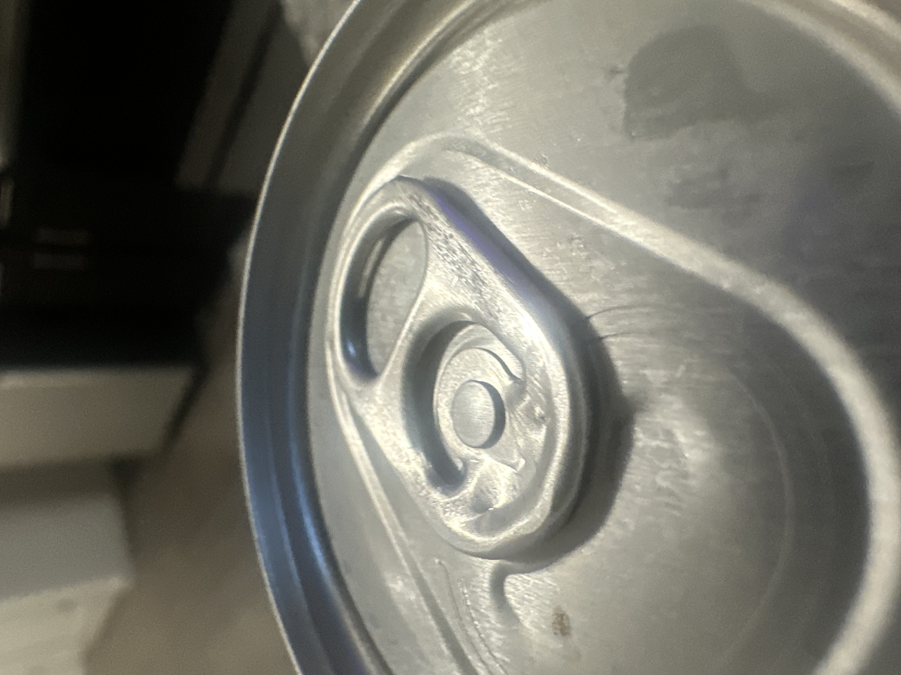

# A1 – Creating a Portfolio    

## Objective
The objective is to analyze two engineering portfolios and use them to help build my own portfolio for MEGR 2561. Additionally, I must analyze a patented product of my choosing and examine the governing model and function.

## Analyze
  _TASK A_: Portfolio Analysis

  **Portfolio 1**
  The first portfolio I decided to analyze was by Hendri Septian on Github (https://hendriseptian.github.io/engineering-portfolio/).
  As soon as you open the portfolio, you're greeted with an into page that has links that lead to his LinkedIn and contact information. It also shows his experience in the field and what he specializes in. His site is very easy to navigate and allows you to click tabs in order to find exactly what you're looking for. Additionally, he includes engineering drawings for all of his designs with a button on the bottom allowing you to view the drawings in full screen. The engineering drawings are easy to understand and the dimensions are clearly shown allowing it to be replicable. The only things missing from this portfolio is a timeline on the parts. 

  **Portfolio 2**
  The second portfolio that I analyzed was by Tyler Vu on Github (https://github.com/TYLERxVU/mech-eng-portfolio/blob/main/portfolio.pdf). He starts his portfolio off with a personal page showing his information as well as a background page diving into his experience and why he wanted to become an engineer. His portfolio is easy to navigate as all the information is presented very neatly on the page. He shows what skills and tools were used as well as documenting a time line in which he completed the task. I believe his work is replicable because he includes videos and detailed CAD models.

_TASK B_: Product Analysis
**Soda Can Pull Tab**

I chose to analyze the pull tab on top of soda cans. 

a) _The primary function is to convert the force from your finger into a concentrated mechanical force that fractures the opening of the can lid along the score line_

b.i) **GOVERNING MODEL**: the mechanical behavior can be modeled using static moment equilibrium about the rivet -> ∑Mrivet​=0

and for the tab: Ffinger​ x Lfinger ​= Fopening​ x Lopening​
where:

Ffinger - force applied by user's finger

Lfinger - distance from rivet to point where finger applies force

Fopening - downward force applied by tab

Lopening - distance from rivet to tab's contact point

b.ii) An assumption could be that the pull tab can be treated as rigid body therefore making the deformation small enough where it can be modeled as rotation about the rivet instead of the bending of the tab.

c)  

Function: the pull tab is a stamped metal lever with a lift end, nose end, and a riveted island. The user places their finger away from the rivet and that creates a moment arm allowing the nose end to drive into the can, tearing away at the metal to create an opening.

Function: the rivet mechanically joins the tab to the can allowing the tab to rotate about the rivet. It is critical because it provides the lever's fulcrum. It also must withstand the reaction forces generated.

## Decide

## Communicate

