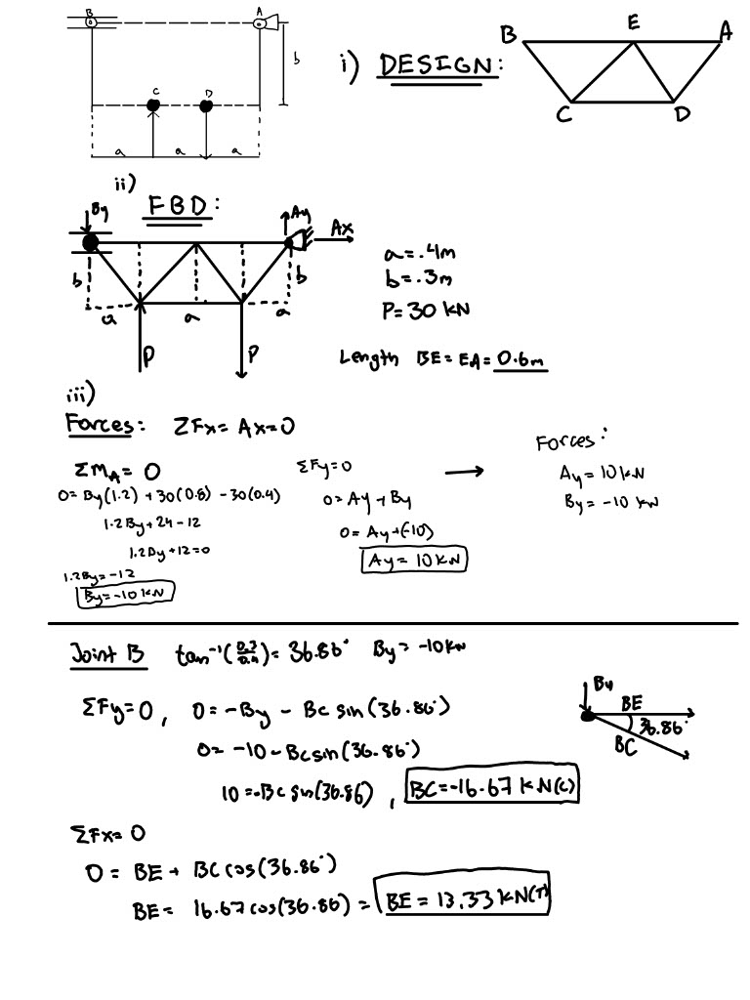
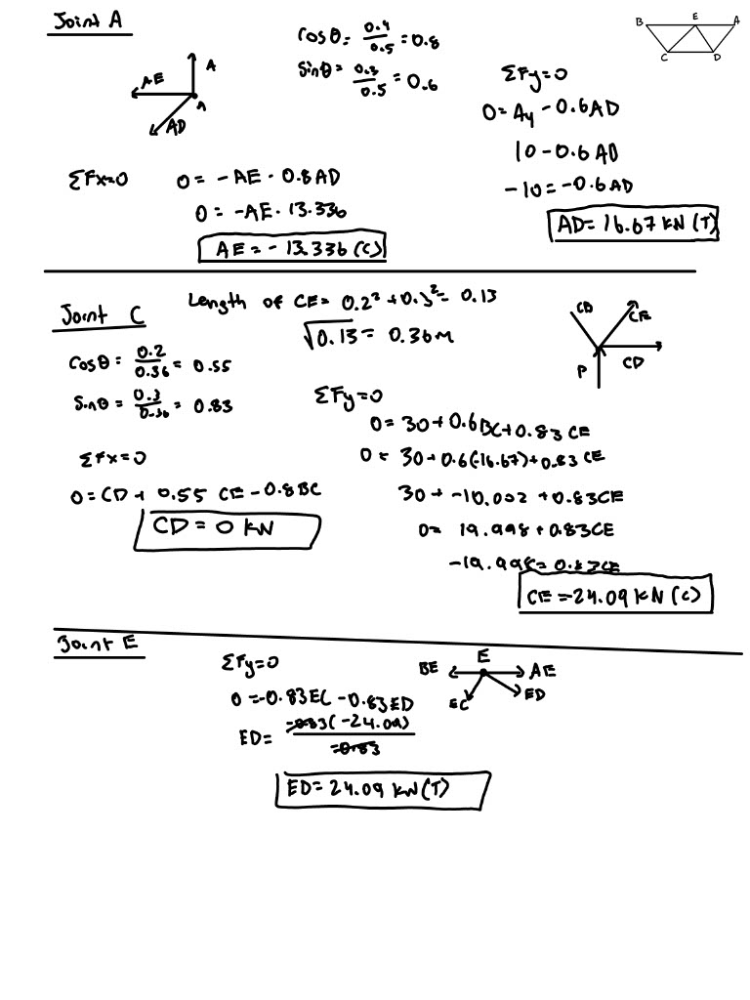
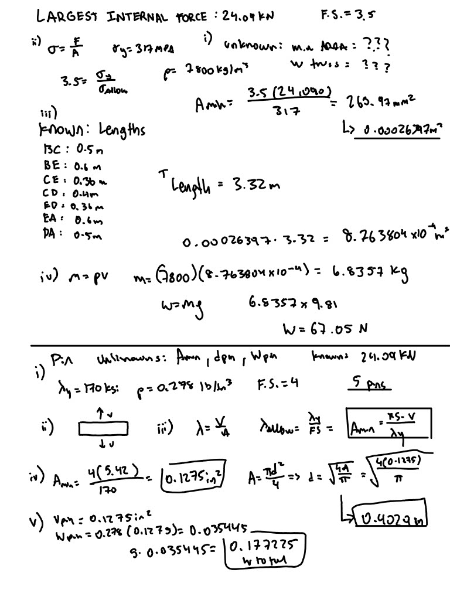
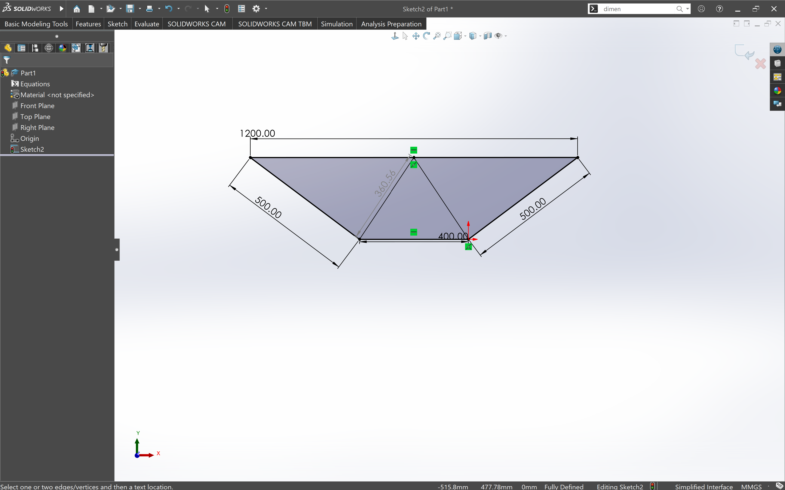
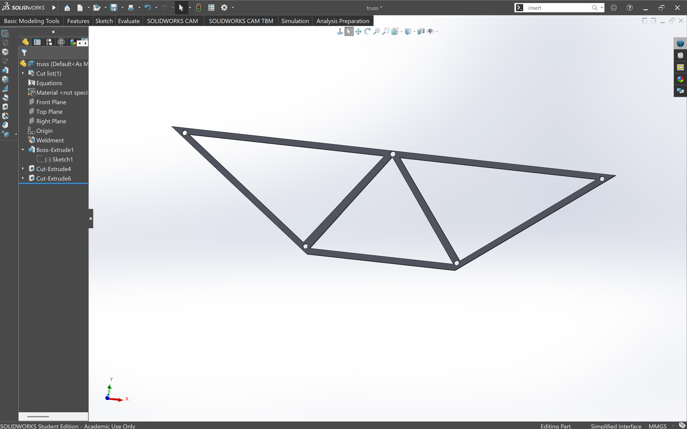
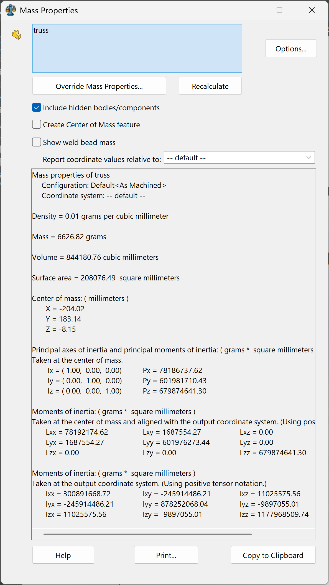

# A2 – Truss Stress Analysis

## Objectives
-Design a lightweight planar truss using A500 steel or an alternative material.
-Create free body diagrams (FBDs) for joints and critical pins.
-Calculate the required cross-sectional area of truss elements with a safety factor.
-Determine pin sizes based on shear forces with a safety factor.
-Solve equations symbolically and numerically for both truss and pin design.
-Estimate the total weight of the truss and pins.
-Create a CAD model with accurate dimensions and connections.
-Compare CAD weight predictions with hand calculations.
-Document key engineering lessons learned from the process.
 
## Communicate
For my first step, the design, I went with a 7 member symmetrical truss that utilizes 5 pins at every connection to maximize sturdiness. The lengths are a = 0.4m and b = 0.3m with a force (P) of 30kn, which was my choice. After that, I started solving for the internal forces using the equations of equilibrium and sum of moments and forces. I decided to go with the Method of Joints to solve for the forces in the joints. I stared with Joint B and worked my way through: A , C , and E. 

After I had complete the internal forces, it was time to take the largest internal force which was 24.09kN, and use that to calculate the minimum area. I listed all of my knowns and unknowns and using a factor of safety of 3.5, I found the minimum area to be 0.00026397m^2 (265.97mm^2). After that, I found the combined weight of 7 member that I was going to be using with the formula w = mg and I got w = 67.05N.

Moving on from the truss calculations, I focused on the details of the pins that I would be using. I listed the knowns and unknowns and used a factor of safety of 4. Using FOS * V / yield strength, I was able to calculate the minimum area and then use the formula 
A = pi*d^2 / 4 to find the diameter. 

For my CAD drawing, I started out with a perimeter of the truss using the given dimensions. Once that was set up, I was ready to create the extrusions to show the members.

[Download SolidWorks Truss Model](completetruss.SLDPRT)
Once I had completed the initial design, it was time to add the holes for the pins - 1 on each corner and 1 in the middle. After that it was complete, I had to choose a material and see how accurate my calculations on my truss weight was. Since SolidWorks didn't have A500 Steel, I chose ASTM A36 Steel which I believed would net me close results. After my calculations, I got a theoretical mass of 6.83kg. Once I chose the material and ran the test, I ended with 6.627kg. This meant that there was only about ~3% error and my model and calculations were very close. 

**Lessons Learned**

I feel like I learned a lot from this assignment. It has been a while since I did any CAD and I had to do a good amount of refreshing before I was able to start working on my project. Additionally, having to not only have correct calculations but also correlate that into the design was a bit challenging but also rewarding when the outcome was similar. Comparing my calculated mass to the mass from SolidWorks  helped me understand the ways calculations can be applied to a real CAD model and used to verify the design. Overall, this assignment gave me a better understanding of how calculations, material selection, and CAD modeling all work together in the engineering design process. This assignment took me about 8 hours to complete.
